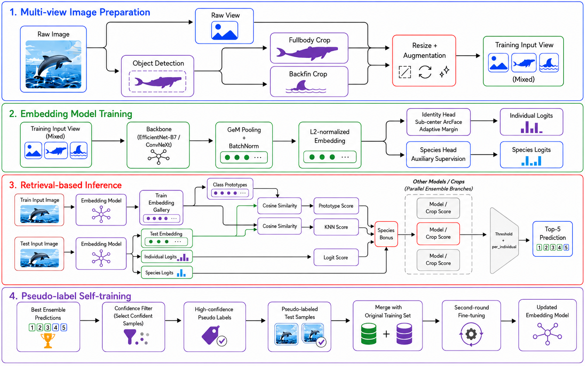
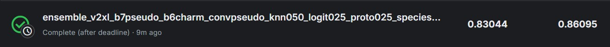

# Happy Whale and Dolphin Identification

[](report/CV_Report.pdf)
[](report/CV_Slide.pdf)

這個專案是電腦視覺課程的期末專題，題目來自 Kaggle **Happy Whale and Dolphin Identification** competition，目標是根據影像辨識每一隻鯨豚個體。
我們主要把這個問題視為 image retrieval / metric learning 任務。每個模型先訓練出具有辨識力的 embedding，推論時再結合 KNN similarity、class prototype、logits、species 資訊、多種 crop mode ensemble，以及最後的多模型融合。

實驗主要在 **Google Colab A100** 上進行。因為 Colab 長時間訓練可能會斷線，notebook 會將 checkpoint、embedding、matrix 和 submission 上傳到 Hugging Face，方便中斷後繼續訓練或推論。

## 課程與組員

- 課程：NYCU Computer Vision 2026
- 組員：
  - 張周芳，314511037
  - 劉霈琳，313554063
  - 何柏翰，112550028

## 專案結構

| 檔案 | 說明 |
| --- | --- |
| [cv_v2xl_model_hf_ipynb.ipynb](cv_v2xl_model_hf_ipynb.ipynb) | EfficientNetV2-XL 的訓練、embedding extraction、crop inference notebook。 |
| [cv_B7_model_hf_ipynb.ipynb](cv_B7_model_hf_ipynb.ipynb) | EfficientNet-B7 notebook，使用 B7 訓練設定。 |
| [cv_B6_model_charm_hf_ipynb.ipynb](cv_B6_model_charm_hf_ipynb.ipynb) | EfficientNet-B6 notebook，包含 full-body、backfin 和 charm crop 設定。 |
| [cv_convnext_model_hf.ipynb](cv_convnext_model_hf.ipynb) | ConvNeXt 單模型分支 notebook。 |
| [cv_final_ensemble_hf.ipynb](cv_final_ensemble_hf.ipynb) | 最終 ensemble notebook，會從 Hugging Face 下載模型輸出、建立或讀取 matrices、融合分數並產生 submissions。 |
| [requirements.txt](requirements.txt) | 本機執行和 Jupyter kernel 所需套件。 |
| [data/README.md](data/README.md) | 說明本機資料集應該放置的資料夾結構。 |

## 方法摘要

- Backbone:
  - EfficientNetV2-XL
  - EfficientNet-B7
  - EfficientNet-B6
  - ConvNeXt
- Training:
  - ArcFace-style classification head
  - Sub-center ArcFace
  - Adaptive margin
  - Optional focal loss
  - Full-body / backfin crop augmentation
- Inference:
  - Embedding similarity
  - KNN score matrix
  - Logit score matrix
  - Class prototype score matrix
  - Species bonus / penalty
  - Weighted crop ensemble
  - Final multi-model ensemble

## Dataset

Notebook 會使用以下 Kaggle / KaggleHub 資料：

- `happy-whale-and-dolphin`: https://www.kaggle.com/competitions/happy-whale-and-dolphin
- `jpbremer/fullbodywhaleannotations`: https://www.kaggle.com/datasets/jpbremer/fullbodywhaleannotations
- `genlaxai/happy-whale-backfin-cropped`: https://www.kaggle.com/datasets/genlaxai/happy-whale-backfin-cropped
- `changchoufang/fullybody-charm`: https://www.kaggle.com/datasets/changchoufang/fullybody-charm

資料集檔案很大，因此不包含在這份程式碼中。在 Colab 執行時，notebook 可以透過 KaggleHub 下載或定位資料。

如果要在本機執行，請把資料放在 `data/` 底下。[data/README.md](data/README.md) 裡也有資料夾範例。

建議結構如下：

```bash
CV_final/
  data/
    happy-whale-and-dolphin/
      train.csv
      sample_submission.csv
      train_images/
      test_images/
    fullbodywhaleannotations/
    happy-whale-backfin-cropped/
    fullybody-charm/
  checkpoints/
  embeddings/
  mats/
  submissions/
```

如果你的本機資料放在不同位置，請在每份 notebook 的 `CFG` 或 `_get_or_download_kaggle_paths()` helper 中修改 path。

也可以在執行 `_get_or_download_kaggle_paths()` 前先定義路徑變數：

```python
happy_whale_and_dolphin_path = "data/happy-whale-and-dolphin"
jpbremer_fullbodywhaleannotations_path = "data/fullbodywhaleannotations"
backfin_path = "data/happy-whale-backfin-cropped"
fullbody_charm_path = "data/fullybody-charm"  # 只有使用 charm crop 的 notebook 需要
```

## Pseudo Labels

本專案也可以使用 [data/pseudo.csv](data/pseudo.csv) 做 pseudo-label training。這個檔案會放在 `data/` 底下：

```bash
CV_final/
  data/
    pseudo.csv
```

我們只提供本專案使用的 pseudo-label CSV，不提供產生 pseudo labels 的程式碼。如果你想要自己產生 pseudo labels，請自行實作或準備產生流程，並把產生出的 CSV 放在 `data/pseudo.csv`，或將 `CFG.pseudo_csv` / `PSEUDO_CSV` 指到你自己的檔案路徑。

若要啟用 pseudo-label training，請設定：

```python
CFG.use_pseudo = True
CFG.pseudo_csv = "data/pseudo.csv"
```

也可以透過 `PSEUDO_CSV` 環境變數覆蓋路徑：

```python
import os
os.environ["PSEUDO_CSV"] = "data/pseudo.csv"
```

預期欄位包含：

- `image`
- `top1_pred`
- `top1_score`
- `top2_pred`
- `top2_score`
- `score_margin_top1_top2`

Notebook 會根據 confidence threshold、margin threshold、known individual IDs，以及每個 ID 的 pseudo sample 上限進行篩選。

## Hugging Face Artifacts

訓練好的 model checkpoints 和 extracted embeddings 會透過 Hugging Face 提供，因為這些檔案太大，不適合放在程式碼資料夾中。

每個單模型 notebook 會使用 Hugging Face repository 儲存：

- checkpoints，例如 `checkpoints/last_checkpoint.pth`
- train/test embedding `.npz` files
- component matrices
- crop submission files

目前 notebook 中使用的 repository 設定如下：

| Model / Output | Hugging Face repository setting |
| --- | --- |
| EfficientNetV2-XL | `fangfang777/happywhale_v2xl_pseudo_768` |
| EfficientNet-B7 | `fangfang777/happywhale_b7_multicrop_fnb_subcenter_species_pseudo_1024_by_lin` |
| EfficientNet-B6 | `liu-peilin/happywhale_b6_pseudo_charm_round2_1024_v2` |
| ConvNeXt | `liu-peilin/conv` |
| Final ensemble output | `liu-peilin/happywhale_ensemble_v2xl_b6_b7_conv_v1` |

如果 repository 是 private，使用者需要具備 read permission 的 Hugging Face token。執行 notebook 前可以設定：

```python
import os
os.environ["HF_TOKEN"] = "your_huggingface_token"
```

最終 ensemble notebook 中，各模型 repository 可以用環境變數覆蓋：

```python
os.environ["HF_REPO_ID_V2XL"] = "your_name/v2xl_repo"
os.environ["HF_REPO_ID_B6"] = "your_name/b6_repo"
os.environ["HF_REPO_ID_B7"] = "your_name/b7_repo"
os.environ["HF_REPO_ID_CONV"] = "liu-peilin/conv"
```

如果想跳過訓練、直接使用提供的 checkpoints 和 embeddings，請先執行 setup/config cells，設定正確的 Hugging Face repo ids，接著執行 download / inference / ensemble cells。

### Artifact Folder 命名規則

Hugging Face repository 中可能會有很多實驗資料夾。選擇 artifacts 時可以用以下規則判斷：

- `checkpoints/last_checkpoint.pth` 是預設 checkpoint，通常用於 resume 或 inference。
- `embeddings` 通常對應 notebook 預設或最新 checkpoint path。
- `embeddings_25`、`embeddings_31` 或其他帶數字的 embedding folder，通常代表特定 epoch 或特定實驗版本。
- Crop submission folder 也可能帶有數字或 score weight tag，例如 `crop_submission_new_correct_single_502030_bonus0.1_31`。
- 如果 notebook 中設定 `CFG.hf_embedding_dir = "embeddings_31"`，就要使用對應的 numbered embedding folder，而不是 generic `embeddings`。

簡單來說，如果某個 model branch 使用特定 epoch 或版本，embedding folder 後面通常會加上該數字；如果沒有指定數字，就使用由 `last_checkpoint` 產生的預設 artifacts。

## 安裝與帳號參考連結

- PyTorch 本機安裝選擇器：https://pytorch.org/get-started/locally/
- Conda 安裝文件：https://docs.conda.io/projects/conda/en/latest/user-guide/install/index.html
- Kaggle API 文件：https://www.kaggle.com/docs/api
- KaggleHub 套件：https://github.com/Kaggle/kagglehub
- Hugging Face access token：https://huggingface.co/settings/tokens
- Hugging Face token 權限說明：https://huggingface.co/docs/hub/security-tokens

## Environment Setup

### Colab A100

這是最推薦的重現環境。

1. 在 Google Colab 打開 notebook。
2. 選擇 GPU runtime，若可用請使用 A100。
3. 執行 notebook 內的安裝 cell，或手動安裝主要套件：

```bash
pip install -q kagglehub timm albumentations huggingface_hub
```

4. 使用 `kagglehub.login()` 或 Colab/Kaggle credentials 設定 Kaggle 權限。
5. 使用 Colab Secrets 或環境變數設定 Hugging Face 權限：

```python
import os
os.environ["HF_TOKEN"] = "your_huggingface_token"
os.environ["HF_REPO_ID"] = "your_name/your_hf_repo"
```

請不要把真實 token 寫死在 notebook 裡。

### 本機環境

可以在本機執行，但完整訓練需要具備足夠 VRAM 的 CUDA GPU。不建議使用 CPU 訓練這些大型模型。

1. 進入專案資料夾：

```bash
cd CV_final
```

2. 建立並啟用 Conda 環境：

```bash
conda create -n happywhale-cv python=3.11 -y
conda activate happywhale-cv
```

3. 依照你的系統設定安裝 PyTorch：

   - 前往 [PyTorch 本機安裝選擇器](https://pytorch.org/get-started/locally/)。
   - 選擇你的作業系統、package 類型（`pip`）和 CUDA 版本。
   - 執行官方產生的安裝指令。

   以下是 CUDA 12.6 範例：

```bash
pip3 install torch torchvision --index-url https://download.pytorch.org/whl/cu126
```

4. 安裝其餘套件：

```bash
pip install -r requirements.txt
```

5. 準備 Kaggle credentials，或在 notebook 中使用 KaggleHub login：

```bash
kaggle competitions download -c happy-whale-and-dolphin
```

或在 notebook 中執行 `kagglehub.login()`。

6. 設定 Hugging Face 環境變數。

Windows PowerShell:

```powershell
$env:HF_TOKEN="your_huggingface_token"
$env:HF_REPO_ID="your_name/your_hf_repo"
```

Linux / macOS:

```bash
export HF_TOKEN="your_huggingface_token"
export HF_REPO_ID="your_name/your_hf_repo"
```

如果要直接使用提供的 checkpoints 和 embeddings，請設定 `HF_TOKEN` 以及 Hugging Face Artifacts 章節提到的 `HF_REPO_ID_*` 變數。

## Workflow

### 1. 訓練單模型

開啟其中一份模型 notebook：

- [cv_v2xl_model_hf_ipynb.ipynb](cv_v2xl_model_hf_ipynb.ipynb)
- [cv_B7_model_hf_ipynb.ipynb](cv_B7_model_hf_ipynb.ipynb)
- [cv_B6_model_charm_hf_ipynb.ipynb](cv_B6_model_charm_hf_ipynb.ipynb)
- [cv_convnext_model_hf.ipynb](cv_convnext_model_hf.ipynb)

執行前請檢查 `CFG`：

```python
CFG.do_train = True
CFG.resume = False
CFG.hf_upload = True
CFG.hf_repo_id = "your_name/your_hf_repo"
```

Notebook 會在本地儲存 checkpoints，並上傳到 Hugging Face。常用 checkpoint path 為：

```python
CFG.hf_checkpoint_file = "checkpoints/last_checkpoint.pth"
```

如果想從我們提供的模型 checkpoint 繼續訓練，請先從對應的 Hugging Face repository 下載 checkpoint，放到 notebook 預期讀取的位置，並開啟 resume：

```python
CFG.resume = True
CFG.hf_checkpoint_file = "checkpoints/last_checkpoint.pth"
```

一般使用者沒有我們 Hugging Face repositories 的 write permission，因此不能把新的 checkpoints 存回我們的 Hugging Face。若要保存自己繼續訓練後的結果，請建立自己的 Hugging Face repository，並設定：

```python
CFG.hf_upload = True
CFG.hf_repo_id = "your_name/your_hf_repo"
```

簡單來說：可以使用我們 Hugging Face 上的 artifacts 下載與 resume，但後續自己訓練出的 checkpoints 和 embeddings 建議上傳到自己的 Hugging Face repository。

### 2. Colab 斷線後恢復訓練

Colab A100 長時間執行可能會斷線，常見情況是接近 24 小時 runtime limit。這些 notebook 設計成可以從 Hugging Face checkpoints 恢復。

恢復流程：

1. 重新打開同一份 notebook。
2. 重新連上 A100 GPU runtime。
3. 重新執行 install、import、data path 和 config cells。
4. 使用同一個 Hugging Face repository：

```python
CFG.hf_repo_id = "your_name/your_hf_repo"
CFG.resume = True
CFG.resume_from_hf = True  # 如果 notebook 支援此選項，會從 Hugging Face 下載 checkpoint
CFG.hf_checkpoint_file = "checkpoints/last_checkpoint.pth"
```

5. 執行 checkpoint loading cell。
6. 繼續訓練。

如果 `hf_upload_each_epoch` 有開啟，每個 epoch 後最新 checkpoint 會上傳到 Hugging Face，因此不需要從 epoch 0 重新開始。

### 3. Extract Embeddings

訓練完成後，切換到 embedding extraction：

```python
CFG.do_train = False
CFG.do_embedding = True
```

Notebook 會輸出 train/test `.npz` 檔案，並上傳到 Hugging Face embedding directory，例如：

```python
CFG.hf_embedding_dir = "embeddings"
```

如果 embeddings 已經在 Hugging Face 上，可以跳過 extraction，直接執行下載 embeddings 的 inference cells。

### 4. 建立 Crop Inference Outputs

要建立 component matrices 和 crop-mode submissions：

```python
CFG.run_mode = "crop_inference"
CFG.do_crop_inference = True
```

Notebook 使用的 crop modes 例如：

```python
CFG.crop_infer_modes = ["fullbody", "backfin", "none"]
```

不同 crop 權重組合由以下設定控制：

```python
CFG.crop_weight_sets
```

### 5. 執行 Final Ensemble

開啟：

[cv_final_ensemble_hf.ipynb](cv_final_ensemble_hf.ipynb)

這份 notebook 會從 Hugging Face 下載各模型輸出，合併 model/crop matrices，做 score fusion，最後產生 final submission files。

執行 final ensemble 前，請確認所有模型分支的 Hugging Face repositories 都可以透過 `HF_TOKEN` 和 `HF_REPO_ID_*` 環境變數存取。

如果你是按照前面的流程自己訓練模型，也可以選擇使用自己訓練出的 artifacts 做 ensemble。請在 [cv_final_ensemble_hf.ipynb](cv_final_ensemble_hf.ipynb) 中修改各模型的 repository 變數和資料夾名稱，讓它們指向你自己的 Hugging Face outputs：

```python
os.environ["HF_REPO_ID_V2XL"] = "your_name/your_v2xl_repo"
os.environ["HF_REPO_ID_B6"] = "your_name/your_b6_repo"
os.environ["HF_REPO_ID_B7"] = "your_name/your_b7_repo"
os.environ["HF_REPO_ID_CONV"] = "your_name/your_convnext_repo"
```

另外也要確認 final ensemble notebook 裡使用的 crop weights、embedding folder names 和 crop submission folder names 是否對應到你自己訓練 / 推論產生的 artifacts。

## Results

### Overall Pipeline

下圖整理了本專案的訓練與推論流程，包含 pseudo-label training、embedding extraction、crop-mode inference，以及 final ensemble fusion。



### Leaderboard Results

| Method | Public | Private |
| --- | ---: | ---: |
| EfficientNet-B7 | 0.84643 | 0.81620 |
| EfficientNet-B6 | 0.83664 | 0.80298 |
| EfficientNetV2-XL | 0.83697 | 0.79945 |
| ConvNeXt-B | 0.80054 | 0.74866 |
| Final ensemble | 0.86095 | **0.83044** |
| Weak baseline | -- | 0.84909 |

最終 leaderboard 截圖如下。


